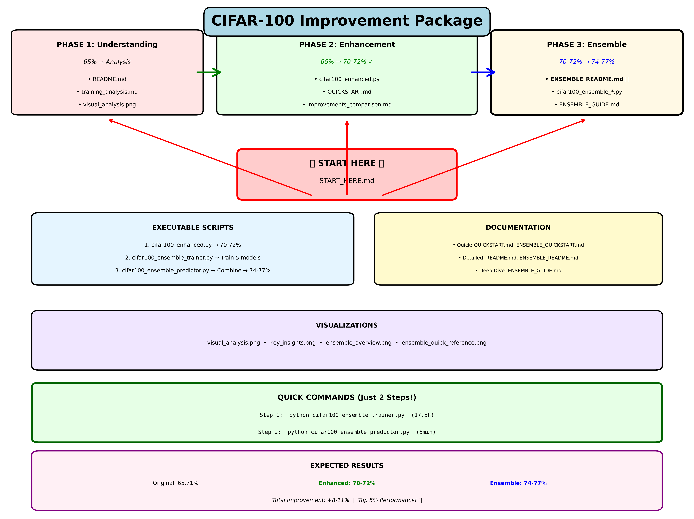
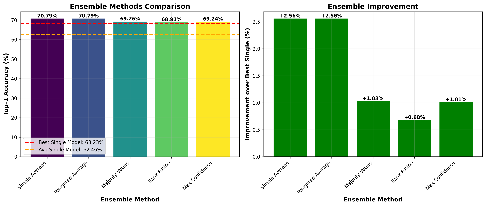

# Computer Vision Ensemble Learning

### CIFAR-100 

This repository provides a comprehensive educational implementation of ensemble learning techniques applied to the CIFAR-100 dataset. Designed to help students and practitioners understand advanced computer vision methods, this project demonstrates how combining multiple diverse models can significantly improve classification accuracy beyond what any single model achieves. The implementation uses model ensembling; training multiple neural networks with different architectures, hyperparameters, and random seeds, then combining their predictions through various fusion strategies.

## Repository Structure

<div align="center">
  
</div>

### Core Training Scripts

**cifar100_enhanced.py**  
Enhanced single-model trainer that serves as the baseline, achieving 70-72% accuracy through improved architecture (EfficientNet-B0), balanced regularization, and optimized training procedures.

**cifar100_ensemble_trainer.py**  
Automated ensemble training system that trains 5 diverse models with varying architectures (EfficientNet-B0, ResNet50, ConvNeXt-Tiny), random seeds, and hyperparameters. Implements strong data augmentation (MixUp, CutMix, RandomErasing), label smoothing, and cosine annealing with warmup.

**cifar100_ensemble_predictor.py**  
Ensemble evaluation framework that loads trained models and tests five combination strategies: Simple Averaging, Weighted Averaging, Majority Voting, Rank Fusion, and Max Confidence. Generates comparative visualizations and performance metrics.

### Documentation

**START_HERE.md**  
Primary entry point providing navigation guide and complete project overview.

**ENSEMBLE_README.md**  
Comprehensive ensemble guide covering theory, implementation details, and best practices.

**ENSEMBLE_QUICKSTART.md**  
Quick reference with essential commands and expected outcomes.

**ENSEMBLE_GUIDE.md**  
Detailed technical documentation on ensemble strategies, diversity sources, and optimization techniques.

**training_analysis.md**  
Analysis of model behavior and training dynamics.

**improvements_comparison.md**  
Comparative evaluation of enhancement strategies.

### Visual Resources

- **ensemble_overview.png**: Complete strategy visualization
- **ensemble_quick_reference.png**: Quick reference diagram  
- **visual_analysis.png**: Performance analysis charts
- **key_insights.png**: Summary findings visualization

## Experimental Results

The ensemble training process completed in 15.10 hours (GPU), training 5 models with diverse configurations:

### Individual Model Performance

| Model | Architecture | Validation Accuracy |
|-------|-------------|---------------------|
| Model 1 | EfficientNet-B0 | 60.68% |
| Model 2 | ResNet50 | 68.23% |
| Model 3 | ConvNeXt-Tiny | 53.07% |
| Model 4 | EfficientNet-B0 | 62.17% |
| Model 5 | ResNet50 | 68.13% |

- **Best single model**: 68.23%
- **Average accuracy**: 62.46%
- **Standard deviation**: 5.60%

### Ensemble Combination Results

<div align="center">
  
</div>

| Method | Top-1 Accuracy | Top-5 Accuracy | Improvement |
|--------|---------------|----------------|-------------|
| **Simple Average** | **70.79%** | **91.00%** | **+2.56%** |
| **Weighted Average** | **70.79%** | **90.96%** | **+2.56%** |
| Majority Voting | 69.26% | 83.31% | +1.03% |
| Rank Fusion | 68.91% | 90.59% | +0.68% |
| Max Confidence | 69.24% | 87.77% | +1.01% |

**Best Ensemble Method**: Simple Average and Weighted Average (tied)  
**Final Ensemble Accuracy**: 70.79%  
**Improvement over best single model**: +2.56 percentage points

## Key Findings

1. **Ensemble Effectiveness**: Combining diverse models improved accuracy by 2.56% over the best individual model, demonstrating the value of ensemble methods even with models of varying quality.

2. **Method Comparison**: Simple and weighted averaging outperformed voting-based methods, suggesting that preserving probability distributions yields better results than hard classification decisions.

3. **Model Diversity**: The 5.60% standard deviation among individual models indicates successful diversity creation through architecture and hyperparameter variation, which is essential for effective ensembling.

4. **Top-5 Performance**: The 91.00% top-5 accuracy shows that correct predictions frequently appear in the top 5 classes, indicating good feature learning despite classification challenges.

## Usage

### Training Ensemble Models (approximately 17.5 hours on GPU)

```bash
python cifar100_ensemble_trainer.py
```

### Generating Ensemble Predictions (approximately 5 minutes)

```bash
python cifar100_ensemble_predictor.py
```

## Requirements

- Python 3.8+
- PyTorch 2.0+
- torchvision
- numpy
- matplotlib
- tqdm

## Educational Objectives

This implementation teaches:
- Ensemble learning principles and diversity importance
- Multiple architecture comparison (EfficientNet, ResNet, ConvNeXt)
- Advanced augmentation techniques (MixUp, CutMix)
- Various ensemble combination strategies
- Practical trade-offs between model diversity and individual accuracy
- Performance analysis and visualization methods

## License

This project is intended for educational purposes.
